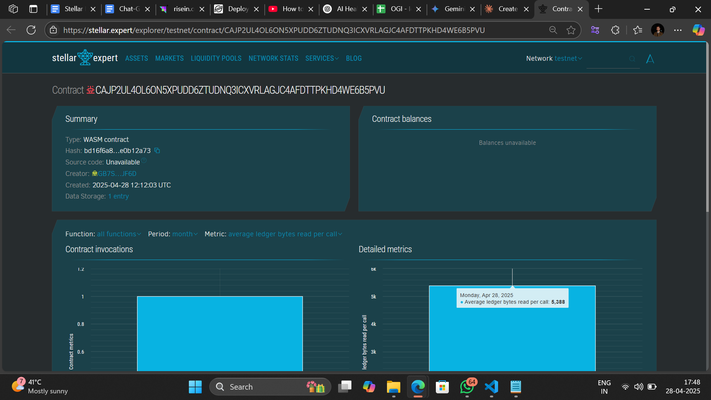

# AI-Based Personal Health Coach

## Project Description

This smart contract serves as the backbone for an AI-based personal health coach platform built on the Stellar blockchain using Soroban SDK. The platform allows users to track their health metrics, set and monitor personal health goals, and receive AI-generated recommendations based on their progress.

## Contract Address deatils:
CAJP2UL4OL6ON5XPUDD6ZTUDNQ3ICXVRLAGJC4AFDTTPKHD4WE6B5PVU

## Project Vision

Our vision is to create a decentralized health coaching system that empowers users to take control of their health while maintaining privacy and ownership of their data. By leveraging blockchain technology, we ensure transparency and immutability of health records while providing personalized coaching through AI algorithms.

## Key Features

1. **Health Record Management**: Store and update user health metrics securely on the blockchain
2. **Goal Setting and Tracking**: Create personalized health goals with measurable targets and deadlines
3. **Progress Monitoring**: Track advancement toward health objectives with transparent data recording
4. **Achievement Recognition**: Automatic detection of completed goals and achievement recording

## Future Scope

- Integration with wearable devices for automated data collection
- Implementation of AI recommendation algorithms based on user progress and patterns
- Token rewards for achieving health goals to incentivize healthy behaviors
- Community features for group challenges and peer support
- Development of specialized health coaching modules for different health conditions
- Integration with professional healthcare providers for comprehensive health management